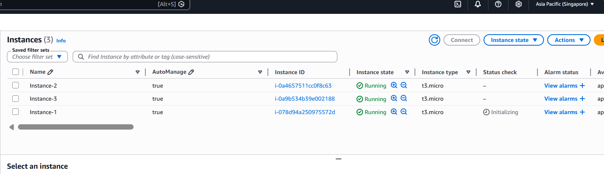
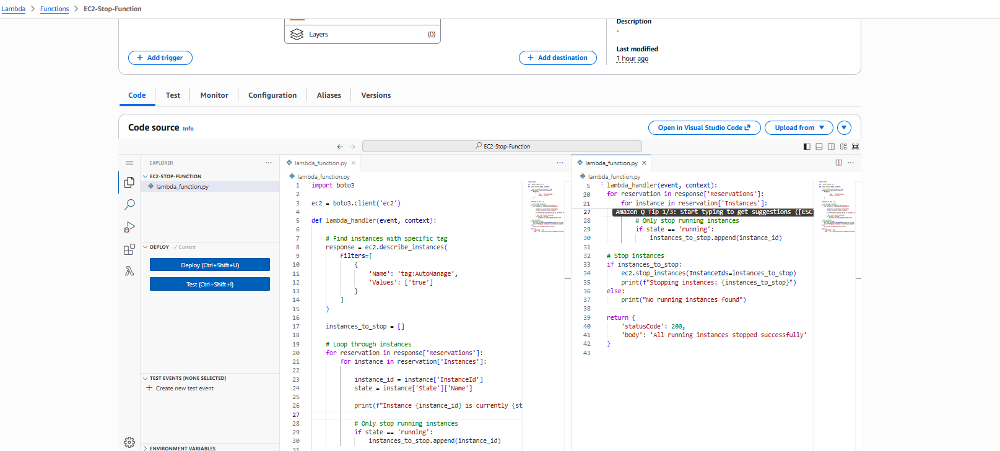
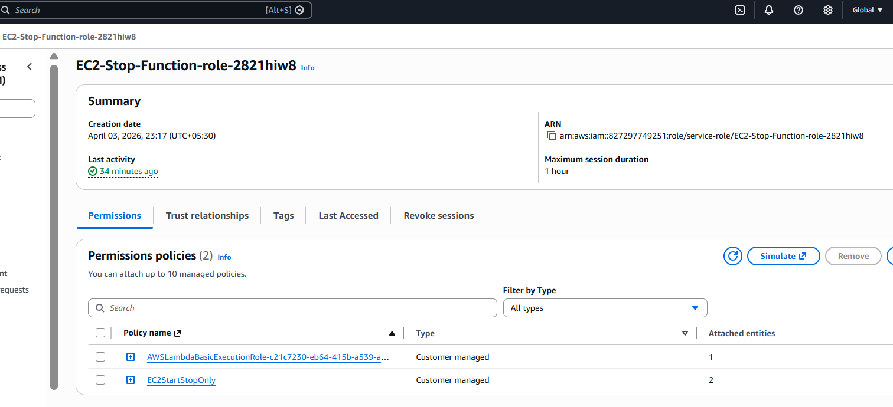
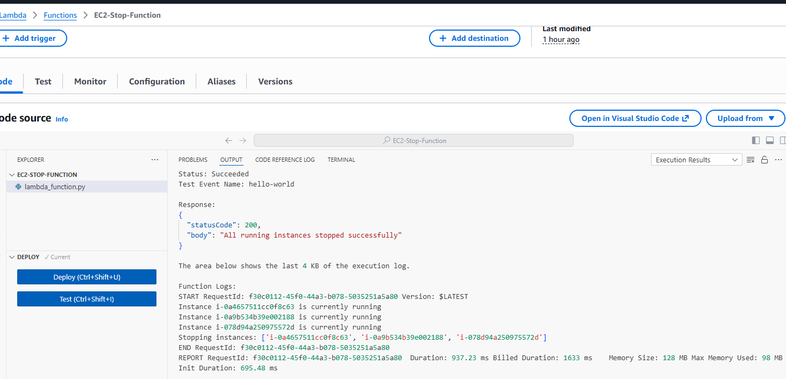
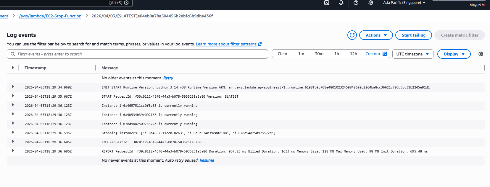
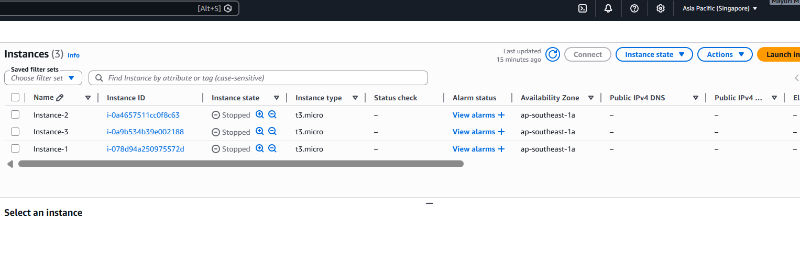

# AWS Lambda EC2 Auto Stop 

## 📌 Problem Statement

In cloud environments, EC2 instances often remain running even when not in use, leading to unnecessary costs.

The goal of this project is to automatically stop running EC2 instances using AWS Lambda based on specific tags, helping in cost optimization.

---

## 🏗️ Solution Overview

This project uses AWS Lambda to identify EC2 instances with a specific tag and stop them if they are in a running state.

* Lambda function scans EC2 instances
* Filters instances using tags
* Stops only running instances
* Ignores already stopped instances

---

## ⚙️ Services Used :

* AWS Lambda
* Amazon EC2
* IAM (Identity and Access Management)
* Amazon CloudWatch (for logs)

---

## 🏷️ Tag-Based Filtering :

Instances are identified using the following tag:

```plaintext
Key: AutoManage
Value: true
```

Only instances with this tag are managed by the Lambda function.

---

## 🔧 Step-by-Step Implementation :

### 1. Created EC2 Instances and added Tags



---

### 2. Created Lambda Function

* Runtime: Python
* Purpose: Stop running EC2 instances



---

### 3. Configured IAM Role

* Attached policy: AmazonEC2FullAccess



---

### 4. Tested Lambda Function



---

## 🧪 Verification Steps :

### Lambda Execution Logs



### Final Result (EC2 Stopped)



---

## 🔐 Security Considerations

* Used IAM role instead of hardcoded credentials
* Limited access using tag-based filtering
* No manual intervention required

---

## 💰 Cost Optimization

* Stops unnecessary running instances
* Helps reduce AWS billing
* Efficient resource utilization

---

## 💡 Key Learnings

* Learned how to use AWS Lambda for automation
* Understood tag-based resource management
* Gained experience with boto3 (AWS SDK for Python)
* Explored CloudWatch logs for debugging

---

## 🚀 Future Improvements

* Add scheduling using EventBridge for automatic execution
* Extend functionality to start instances as needed
* Use more granular IAM permissions

---

## 🎯 Conclusion

This project demonstrates how AWS Lambda can be used to automate EC2 instance management and optimize cloud costs using tag-based filtering.

